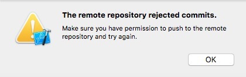

# Git笔记

###基本操作
* 初始化：`git init`
* 添加远程仓库：`git remote add origin <url>`
* 移除已添加远程仓库：`git remote set-url origin <url>`
* 克隆远程仓库：`git clone <url>`
* 克隆远程仓库（只clone master分支的每个文件最新的一个提交）：`git clone <url> master --depth=1`
* 添加所有文件：`git add *`
* 移动文件或目录，或是更改其名称：`git mv <old path> <new path>`、`git mv <old name> <new name>`
* 从本地仓库移除文件夹：`git rm -r --cached <floder>`
* 移除文件：`git rm <file>`
* 添加提交文件到本地仓库：`git commit -m "message"`
* 修改最后一次提交（如果已经推送了最后一次提交就不要修正它）：`git commit --amend`
* 修改多个提交信息（这是一个变基命令 - 在 HEAD~3..HEAD 范围内的每一个提交都会被重写，无论你是否修改信息）：`git rebase -i HEAD~3`
* 从本地仓库push文件到远程主仓库：`git push origin master`
* 从远程主仓库pull文件到本地仓库：`git pull origin master`
* 查看commit日志：`git log`
* 查看commit日志（一行显示）：`git log --pretty=oneline`
* 查看commit日志（仅显示SHA1的前7个字符）：`git log --abbrev-commit`
* 查看commit日志（一行显示，仅显示SHA1的前7个字符混合使用）：`git log --pretty=oneline --abbrev-commit`
* 插件commit日志（显示 ASCII 图形表示的分支合并历史）：`git log --graph`
* 自定义commit日志格式：`git log --color --graph --pretty=format:'%Cred%h%Creset -%C(yellow)%d%Creset %s %Cgreen(%cr) %C(bold blue)<%an>%Creset' --abbrev-commit --`
* 查看仓库状态：`git status`
* 查看修改：`git diff`
* 撤销添加到缓存区的修改：`git reset HEAD <file>`，`HEAD`表示最新的版本
* 设置别名：`git config --global alias.<alias> <original name>`或直接在`.gitconfig`文件中添加
* 改变中文默认转义成/xxx/xxx/xxx：`git config --global core.quotepath false` ore.quotepath设为false的话，就不会对0×80以上的字符进行quote。中文显示正常。

```
[alias]
	<alias> = <original name>
	
示例：
[alias]
	st = status
	ci = commit
	co = checkout
	br = branch
	logpre = log --color --graph --pretty=format:'%Cred%h%Creset -%C(yellow)%d%Creset %s %Cgreen(%cr) %C(bold blue)<%an>%Creset' --abbrev-commit --
```
* 忽略文件和文件夹：新建`.gitignore`（windows中需要创建时使用.gitignore.后面加一个.才不会报不能存在空名字的问题），然后添加忽略文件和文件夹的路径，如果想忽略文件夹下面的所有文件和文件夹，但是同时想保存这个文件夹，这时就需要在这个文件夹下面新建.gitkeep文件(1)

###分支
* 新建本地分支：`git branch <branch>`
* 切换本地分支：`git checkout <branch>`
* 推送本地分支：`git push origin <branch>`
* 新建并切换本地分支：`git checkout -b <branch>`
* 删除本地分支：`git branch -d <branch>`
* 强制删除本地分支：`git branch -D <branch>`
* 查看本地分支：`git branch`
* 查看远程分支：`git branch -r`
* 查看所有分支（包括远程分支）：`git branch -a`
* 删除远程分支：`git push origin --delete <branch>`或`git push origin :<branch>`
* 跟踪（tracking）远程分支：`git checkout -b [分支名] [远程名]/[分支名]`
* 重命名本地分支：`git branch -m <preBranchName> <branch>`
* 重命名远程分支：重命名远程分支实际上就是删除远程分支，然后修改本地分支名，再推送本地分支到远程


### merge命令
> 合并分支时，如果可能，Git会用`Fast forward`模式，但这种模式下，删除分支后，会丢掉分支信息。

* 合并指定分支到当前分支：`git merge <branch>`
* 禁用`Fast forward`模式的合并（能够在分支删除后保留合并信息）：`git merge --no-ff -m "message" <branch>`


###stash命令
* 储藏当前的改变（切换分支时可以保存现场，不需要先commit changes）：`git stash`
* 查看stash队列：`git stash list`
* 恢复stash（并删除对应的stash）：`git stash pop stash@{<num>}`
* 恢复stash（不删除对应的stash）：`git stash apply stash@{<num>}`
* 清空stash队列：`git stash clear`


###标签
* 新建标签：`git tag <tag>`
* 对某次commit新建标签：`git tag <tag> <commit id>`
* 推送某个标签到远程：`git push origin <tag>`
* 一次性推送全部尚未推送到远程的本地标签：`git push origin --tags`
* 删除一个本地标签：`git tag -d <tag>`
* 删除一个远程标签：`git push origin :refs/tags/<tag>`
* 查看标签：`git tag`
* 查看标签信息：`git show <tag>`
* 创建带有说明的标签，用-a 指定标签名，-m指定说明文字：`git tag -a <tag> -m <message>`
* 用GPG签名标签（必须安装gpg）：`git tag -s <tag> -m <message>`
* 通过标签创建分支：`git checkout -b <branch> <tag>`


###别名
下面列出了一些有用的别名：

| 别名 Alias | 命令 Command | 如何设置 What to Type |
| --- | --- | --- |
| `git cm` | `git commit` | `git config --global alias.cm commit` |
| `git co` | `git checkout` | `git config --global alias.co checkout` |
| `git ac` | `git add . -A` `git commit` | `git config --global alias.ac '!git add -A && git commit'` |
| `git st` | `git status -sb` | `git config --global alias.st 'status -sb'` |
| `git tags` | `git tag -l` | `git config --global alias.tags 'tag -l'` |
| `git branches` | `git branch -a` | `git config --global alias.branches 'branch -a'` |
| `git cleanup` | `git branch --merged \| grep -v '*' \| xargs git branch -d` | `git config --global alias.cleanup "!git branch --merged | grep -v '*' | xargs git branch -d"` |
| `git remotes` | `git remote -v` | `git config --global alias.remotes 'remote -v'` |
| `git lg` | `git log --color --graph --pretty=format:'%Cred%h%Creset -%C(yellow)%d%Creset %s %Cgreen(%cr) %C(bold blue)<%an>%Creset' --abbrev-commit --` | `git config --global alias.lg "log --color --graph --pretty=format:'%Cred%h%Creset -%C(yellow)%d%Creset %s %Cgreen(%cr) %C(bold blue)<%an>%Creset' --abbrev-commit --"` |

### GitLab操作
* 分支权限管理：
> * 在`Member`中添加用户，`Project Access`选择`Developer`；
> * 在`Setting`-`Protected Branches`中，选择需要管理的分支，如果勾选`Developers can push`，则`Developer`用户可以`push`，否则不能`push`到对应的分支；
> * 用户没有`push`权限时，在`Xcode`中会有下图所示的提示
> 
 

### 参考

1. [Git教程](https://git-scm.com/book/zh/v2)
2. [How can I add an empty directory to a Git repository? -> Mark Amery](http://stackoverflow.com/questions/115983/how-can-i-add-an-empty-directory-to-a-git-repository)
3. [Git教程](http://www.liaoxuefeng.com/wiki/0013739516305929606dd18361248578c67b8067c8c017b000)
4. [分支管理](http://zengrong.net/post/1746.htm)
5. [git commit日志输出](http://ruby-china.org/topics/939)
6. [GitHub备忘录](https://github.com/tiimgreen/github-cheat-sheet/blob/master/README.zh-cn.md)
7. [git乱码解决方案汇总](https://gist.github.com/vkyii/1079783#file-git-txt)