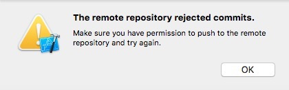

# Git笔记

### 配置

* 下载[Git](http://git-scm.com/download/)
* windows版本安装完成后，配置环境变量（..\Git\bin;）
* [配置SSH公钥](https://coding.net/help/doc/git/ssh-key.html)

### 基本操作

* 初始化：`git init`
  
* 添加远程仓库：`git remote add origin <url>`
  
* 更换已添加远程仓库：`git remote set-url origin <url>`
  
* 移除已添加远程仓库：`git remote rm origin`
  
* 克隆远程仓库：`git clone <url>`
  
* 克隆远程仓库（只clone master分支的每个文件最新的一个提交）：`git clone <url> master --depth=1`
  
* 添加所有文件：`git add *`
  
* 移动文件或目录，或是更改其名称：`git mv <old path> <new path>`、`git mv <old name> <new name>`
  
* 从本地仓库移除文件或文件夹：`git rm --cached <filename>`、`git rm -r --cached <floder>`
  
* 移除文件：`git rm <file>`
  
* 添加提交文件到本地仓库：`git commit -m "message"`
  
* 停止变基：`git rebase --abort`
  
* 修改最后一次提交（如果已经推送了最后一次提交就不要修正它）：`git commit --amend`
  
* 修改多个提交信息（这是一个变基命令 - 在 HEAD~<number>..HEAD 范围内的每一个提交都会被重写，无论你是否修改信息）：先执行`git rebase -i HEAD~<number>`变基，然后把需要编辑的提交id前面的`pick`改为`edit`后退出编辑，运行`git commit --amend`，修改好message后，再运行`git rebase --continue`后将会自动地应用另外前面的几个提交
  
  > 这个命令将会自动地应用另外两个提交，然后就完成了。 如果需要将不止一处的 pick 改为 edit，需要在每一个修改为 edit 的提交上重复这些步骤（运行`git commit --amend`，修改好message后，再运行`git rebase --continue`）。 每一次，Git 将会停止，让你修正提交，然后继续直到完成。
  
* 从本地仓库push文件到远程主仓库：`git push origin master`
  
* 从远程主仓库pull文件到本地仓库：`git pull origin master`
  
* 查看所有日志记录：`git reflog`
  
* 查看commit日志：`git log`
  
* 查看commit日志（一行显示）：`git log --pretty=oneline`
  
* 查看commit日志（仅显示SHA1的前7个字符）：`git log --abbrev-commit`
  
* 查看commit日志（一行显示，仅显示SHA1的前7个字符混合使用）：`git log --pretty=oneline --abbrev-commit`
  
* 插件commit日志（显示 ASCII 图形表示的分支合并历史）：`git log --graph`
  
* 自定义commit日志格式：`git log --color --graph --pretty=format:'%Cred%h%Creset -%C(yellow)%d%Creset %s %Cgreen(%cr) %C(bold blue)<%an>%Creset' --abbrev-commit --`
  
* 查看仓库状态：`git status`
  
* 查看修改：`git diff`
  
* 生成一个新的提交来撤销某次提交，此次提交之前的commit记录都会被保留，并且工程将恢复到对应commit id位置：`git revert <commit id>`
  
* 撤销添加到缓存区的修改：`git reset HEAD <file>`，`HEAD`表示最新的版本
  
* 设置别名：`git config --global alias.<alias> <original name>`或直接在`.gitconfig`文件中添加
  
  ``` 
  [alias]
  	<alias> = <original name>
  	
  示例：
  [alias]
  	st = status
  	ci = commit
  	co = checkout
  	br = branch
  	logpre = log --color --graph --pretty=format:'%Cred%h%Creset -%C(yellow)%d%Creset %s %Cgreen(%cr) %C(bold blue)<%an>%Creset' --abbrev-commit --
  ```
  
* 忽略文件和文件夹：新建`.gitignore`（windows中需要创建时使用.gitignore.后面加一个.才不会报不能存在空名字的问题），然后添加忽略文件和文件夹的路径，如果想忽略文件夹下面的所有文件和文件夹，但是同时想保存这个文件夹，这时就需要在这个文件夹下面新建.gitkeep文件(1)
  
* 改变中文默认转义成/xxx/xxx/xxx：`git config --global core.quotepath false`  core.quotepath设为false的话，就不会对0×80以上的字符进行quote。中文显示正常。
  
* 更改remote：`git remote rm origin`然后添加`git remote add origin <url>`
  
* 配置公钥：Mac/Linux 打开命令行终端, Windows 打开 Git Bash 。 输入`ssh-keygen -t rsa -C "[username@example.com](mailto:username@example.com)"`,( 注册的邮箱)，接下来点击enter键即可（也可以输入密码）。
  
  ``` 
  $ssh-keygen -t rsa -b 4096 -C "your_email@example.com"
  # Creates a new ssh key, using the provided email as a label
  # Generating public/private rsa key pair.
  Enter file in which to save the key (/Users/you/.ssh/id_rsa): [Press enter]  // 推荐使用默认地址,如果使用非默认地址可能需要配置 .ssh/config
  ```
  
  成功之后
  
  ``` 
  Your identification has been saved in /Users/you/.ssh/id_rsa.
  # Your public key has been saved in /Users/you/.ssh/id_rsa.pub.
  # The key fingerprint is:
  # 01:0f:f4:3b:ca:85:d6:17:a1:7d:f0:68:9d:f0:a2:db your_email@example.com
  ```

### Commit命令

* 允许提交一条空message的commit：`git commit --allow-empty-message`
  
* 修改最后一次提交（如果已经推送了最后一次提交就不要修正它）：`git commit --amend`
  
* 修改多个提交信息（这是一个变基命令 - 在 HEAD~<number>..HEAD 范围内的每一个提交都会被重写，无论你是否修改信息）：先执行`git rebase -i HEAD~<number>`变基，然后把需要编辑的提交id前面的`pick`改为`edit`后退出编辑，运行`git commit --amend`，修改好message后，再运行`git rebase --continue`后将会自动地应用另外前面的几个提交
  
  > 这个命令将会自动地应用另外两个提交，然后就完成了。 如果需要将不止一处的 pick 改为 edit，需要在每一个修改为 edit 的提交上重复这些步骤（运行`git commit --amend`，修改好message后，再运行`git rebase --continue`）。 每一次，Git 将会停止，让你修正提交，然后继续直到完成。

#### [git reset, git checkout, git revert 区别](https://segmentfault.com/a/1190000003102737)  **关于git reset会撤销工作区的文件的说法是错误的，只会撤销工作区的修改，但不是删除未添加到暂存区的文件（另外要注意三种模式--soft、--mixed、--hard）**

##### git checkout (**撤销工作区的修改**)

> 注意：git checkout只会撤销修改的文件，对于从未add的文件是没有git checkout -- file操作的。

* 撤销test.md文件的修改：`git checkout -- test.md`，其中`--`非常重要，否则就变成切换分支了

##### git reset（**撤销暂存区的修改**）

> 注意：git reset只会撤销修改的文件和commit过的文件，对于从未add的文件是无效的。
> 
> git repo 的三大 components，分别是 working directory(代码仓库) staged snapshot(快照:add的缓存库) commit history(commit历史) 
> 
> 这些标记经常和HEAD一起使用。例如，git reset --mixed HEAD可撤销所有缓存改动，但是保留他们在工作目录下。git reset --hard HEAD可彻底删除没有提交的改动。

* 撤销添加到缓存区的修改：`git reset HEAD <file>`，`HEAD`表示最新的版本
* 版本回退（**慎用，会撤销工作区文件的修改和所有添加到暂存区的文件<也就是所有add和modify的文件>，但是不会撤销工作区的没有添加到暂存区的文件<也就是所有没有add的文件>**）：`git reset --hard <commid id>`
* **--soft**： staged snapshot 和 working directory 都未被改变 (建议在命令行执行后，再输入 git status 查看状态)，也就是保留之前的`add`。**注意，就算是先执行过`git rebase`变换过commit顺序，使用`git reset --soft`也会保留这个commit的所有改动的文件记录到暂存区，变成绿色**
* **--mixed**： staged snapshot 被更新， working directory 未被更改。【这是默认选项】（建议同上)，也就是不保留之前的`add`，同时未`add`的文件会保留在文件需要手动重新`add`。
* **--hard**： 只有staged snapshot将回退， working directory修改的文件会被撤销working directory 未添加的文件不会删掉。

#### git revert
* `git revert` 命令通过创建一次新的 `commit` 来撤销一次 `commit` 所做出的修改。这种撤销的方式是安全的，因为它并不修改 commit history, 比如下边的命令将会查出倒数第二次（即当前commit的往前一次）提交的修改，并创建一个新的提交，用于撤销当前提交的上一次 commit。

### 分支

* 新建本地分支：`git branch <branch>`
* 切换本地分支：`git checkout <branch>`
* 推送本地分支：`git push origin <branch>`
* 新建并切换本地分支：`git checkout -b <branch>`
* 删除本地分支：`git branch -d <branch>`
* 强制删除本地分支：`git branch -D <branch>`
* 查看本地分支：`git branch`
* 查看远程分支：`git branch -r`
* 查看所有分支（包括远程分支）：`git branch -a`
* 删除远程分支：`git push origin --delete <branch>`或`git push origin :<branch>`
* 跟踪（tracking）并切换到远程分支：`git checkout -b [分支名] [远程名]/[分支名]`
* 让本地分支跟踪远程分支：`git branch --set-upstream-to=origin/<branch> <local_branch>`
* 重命名本地分支：`git branch -m <preBranchName> <branch>`
* 重命名远程分支：重命名远程分支实际上就是删除远程分支，然后修改本地分支名，再推送本地分支到远程

### merge命令

> 合并分支时，如果可能，Git会用`Fast forward`模式，但这种模式下，删除分支后，会丢掉分支信息。

* 合并指定分支到当前分支：`git merge <branch>`
* 禁用`Fast forward`模式的合并（能够在分支删除后保留合并信息）：`git merge --no-ff -m "message" <branch>`
* 撤销merge：找到在这个分支上提交的最新的commit，然后执行`git reset --hard <commit id>`即可
* 如果不想在merge时出现merge commit的记录，可以在命令后面加上`--no-commit`

### stash命令
> stash应用的场景：1.还没写完不想commit；2.commit在错误的分支，不想合并这个commit到另一个分支，这时就可以先`reset --soft`退回然后`stash`,再checkout到另一个分支commit。

* 储藏当前的改变（切换分支时可以保存现场，不需要先commit changes。特别注意：**使用stash时，untracked的文件将会丢失**）：`git stash`
* 查看stash队列：`git stash list`
* 恢复stash（并删除对应的stash）：`git stash pop stash@{<num>}`
* 恢复stash（不删除对应的stash）：`git stash apply stash@{<num>}`
* 清空stash队列：`git stash clear`
* 取消储藏：`git stash show -p stash@{0} | git apply -R`
* 从储藏中创建分支：`git stash branch <branch name>`
* 当执行`git stash pop`出现文件冲突时，可以先解决冲突，再`git stash drop`删除stash，因为冲突时不会主动删除stash记录

### rebase命令

* 修改多条commit：`git rebase –i HEAD~n`后，把其中一个`pick`改为`edit`，退出编辑进入新的message编辑窗口，然后编辑message后退出即可
* 终端rebase：`git rebase --abort`
* 重排提交：`git rebase –i HEAD~n`（内部顺序为反序），然后到里面修改提交顺序，退出即可，**注意里面还可以删除掉某个commit提交**
* 压制(Squashing)提交：`git rebase –i HEAD~n`后，把其中一个`pick`改为`s`或`squash`，退出编辑进入新的message编辑窗口，然后编辑message后退出即可，如下图

### checkout命令

* 回滚文件到某一个Commit位置：`git checkout <commit id> <file path>`

### 标签

* 新建标签：`git tag <tag>`
* 对某次commit新建标签：`git tag <tag> <commit id>`
* 推送某个标签到远程：`git push origin <tag>`
* 一次性推送全部尚未推送到远程的本地标签：`git push origin --tags`
* 删除一个本地标签：`git tag -d <tag>`
* 删除一个远程标签：`git push origin :refs/tags/<tag>`
* 查看标签：`git tag`
* 查看标签信息：`git show <tag>`
* 创建带有说明的标签，用-a 指定标签名，-m指定说明文字：`git tag -a <tag> -m <message>`
* 对某次commit创建带有说明的标签，用-a 指定标签名，-m指定说明文字：`git tag -a <tag> <commit id> -m <message>`
* 用GPG签名标签（必须安装gpg）：`git tag -s <tag> -m <message>`
* 通过标签创建分支：`git checkout -b <branch> <tag>`

### 别名

下面列出了一些有用的别名：

| 别名 Alias       | 命令 Command                               | 如何设置 What to Type                        |
| -------------- | ---------------------------------------- | ---------------------------------------- |
| `git cm`       | `git commit`                             | `git config --global alias.cm commit`    |
| `git co`       | `git checkout`                           | `git config --global alias.co checkout`  |
| `git ac`       | `git add . -A` `git commit`              | `git config --global alias.ac '!git add -A && git commit'` |
| `git st`       | `git status -sb`                         | `git config --global alias.st 'status -sb'` |
| `git tags`     | `git tag -l`                             | `git config --global alias.tags 'tag -l'` |
| `git branches` | `git branch -a`                          | `git config --global alias.branches 'branch -a'` |
| `git cleanup`  | `git branch --merged \                   | grep -v '*' \                            |
| `git remotes`  | `git remote -v`                          | `git config --global alias.remotes 'remote -v'` |
| `git logpre`   | `git log --color --graph --pretty=format:'%Cred%h%Creset -%C(yellow)%d%Creset %s %Cgreen(%cr) %C(bold blue)<%an>%Creset' --abbrev-commit --` | `git config --global alias.logpre "log --color --graph --pretty=format:'%Cred%h%Creset -%C(yellow)%d%Creset %s %Cgreen(%cr) %C(bold blue)<%an>%Creset' --abbrev-commit --"` |

### submodule

##### 创建submodule工程
* 使用`git submodule add <url> <path>`，不加path默认当前路径

##### 构建submodule工程
* 构建包含submodule的工程时，先进行`git submodule init`，然后再执行`git submodule update --remote`
* 如果出现`Please make sure you have the correct access rights and the repository exists.`错误，可能是没有库访问的权限问题
* 如果出现`Host key verification failed. fatal: Could not read from remote repository.`，则请用ssh链接，并生成ssh的`id_rsa.pub`文件并配置到git服务器端，配置好之后执行`ssh -T git@xxx.com`，输入yes回车即可，参考[这里](https://blog.csdn.net/jingtingfengguo/article/details/51892864)

### GitLab操作

* 分支权限管理：
  
  > * 在`Member`中添加用户，`Project Access`选择`Developer`；
  >   
  > * 在`Setting`-`Protected Branches`中，选择需要管理的分支，如果勾选`Developers can push`，则`Developer`用户可以`push`，否则不能`push`到对应的分支；
  >   
  > * 用户没有`push`权限时，在`Xcode`中会有下图所示的提示
  >   
  >   

### Github使用手册

* [地址](https://github.com/tiimgreen/github-cheat-sheet/blob/master/README.zh-cn.md)

### 速查表

 

### 常见错误

* `Xcode`执行`commit`时出现`Couldn’t communicate with a helper application.`
  
  > 可以在命令行中使用`git commit <file> -m <message>`
  
* 如果Xcode进行pull出现检测冲突，检测完之后没有出现冲突的类的选取的编辑框，也没有pull成功
  
  > 用命令行进行pull，出现冲突后，手动解决冲突即可
  
* error: pathspec 'xxx.m' did not match any file(s) known to git.
  
  > 可以在命令行中使用`git commit <file> -m <message>`
  
* The source control operation failed because no repository could be found.
  
  > 可以在命令行中使用`git commit <file> -m <message>`

* Git - Your branch and 'origin/xxx' have diverged

	> 在本地分支执行`git rebase`，然后`push`到远端

* A电脑改名后提交到git，然后B电脑也改动了同一个文件，但是在`pull`之前B电脑没有`commit`，而是使用`stash`再`pull`下远程的改动，然后再`stash pop`之后解决`updated stream`和`stash`产生的冲突，最后出现了下面的问题，一直使用`add`都不能`add`进`index`中。折腾半天后，发现时由于A电脑改名的引起的问题，于是执行`git mv git笔记.md Git笔记.md`修复了。**可能是由于之前在A电脑上rename没有使用 `git rm`**。详细记录如下：

	

	

	
如果出现大小写文件夹出现冲突的问题，比如只想保留大写下面的文件，那就可以先把同时处在两个大小写不同的目录下的文件复制出来（实际中你只能看到一个文件，但这个文件代表两个目录下的文件），再使用`git rm -r <floder>`移除，再把备份的文件copy进来，以达到删除小写目录的操作

* 当`git status`出现下面的`have diverged`状态并且不能pull时

	```
	On branch develop
Your branch and 'origin/develop' have diverged,
and have 2 and 8 different commits each, respectively.
	```
可尝试关闭编辑器，可能是编辑器占用资源引起的

### git commit的message规范
* `ADD <msg>` 增加文件、功能等
* `MOD <msg>` 修改文件、逻辑等
* `FIX <msg>` 修复Bug

### 参考

1. [Git教程](https://git-scm.com/book/zh/v2)
2. [GitHub备忘录](https://github.com/tiimgreen/github-cheat-sheet/blob/master/README.zh-cn.md)
3. [Git教程-廖雪峰](http://www.liaoxuefeng.com/wiki/0013739516305929606dd18361248578c67b8067c8c017b000)
4. [Git简明指南](http://rogerdudler.github.io/git-guide/index.zh.html)
5. [How can I add an empty directory to a Git repository? -> Mark Amery](http://stackoverflow.com/questions/115983/how-can-i-add-an-empty-directory-to-a-git-repository)
6. [分支管理](http://zengrong.net/post/1746.htm)
7. [git commit日志输出](http://ruby-china.org/topics/939)
8. [git乱码解决方案汇总](https://gist.github.com/vkyii/1079783#file-git-txt)
9. [How can I merge two commits into one?](http://stackoverflow.com/questions/2563632/how-can-i-merge-two-commits-into-one)
10. [git-recipes-高质量的Git中文教程](https://github.com/geeeeeeeeek/git-recipes/wiki)
11. [代码回滚：Reset、Checkout、Revert的选择](https://github.com/geeeeeeeeek/git-recipes/wiki/5.2-代码回滚：Reset、Checkout、Revert的选择)
12. [Git 原理入门](http://www.ruanyifeng.com/blog/2018/10/git-internals.html)
13. [Git飞行规则(Flight Rules)](https://github.com/k88hudson/git-flight-rules/blob/master/README_zh-CN.md)