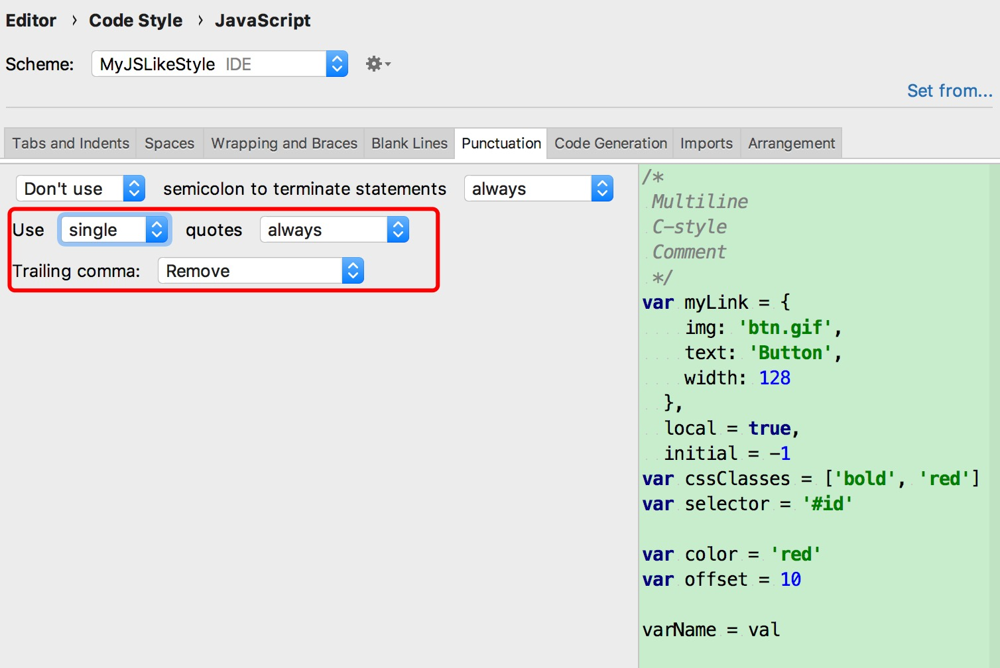

# WebStorm
> 注册码[地址](https://blog.csdn.net/hdp134793/article/details/81530472)

在打开的 `License Activation` 窗口中选择 `License server`。点击 `Activate`。

### JS代码风格设置
1. `Setting` - `Editor` - `Code Style` - `JavaScript`，点击`Set from...`的`Predefined Style`为`JavaScript Standard Style`
2. `Setting` - `Editor` - `Code Style` - `JavaScript` - `Punctucation`，进行下图的设置